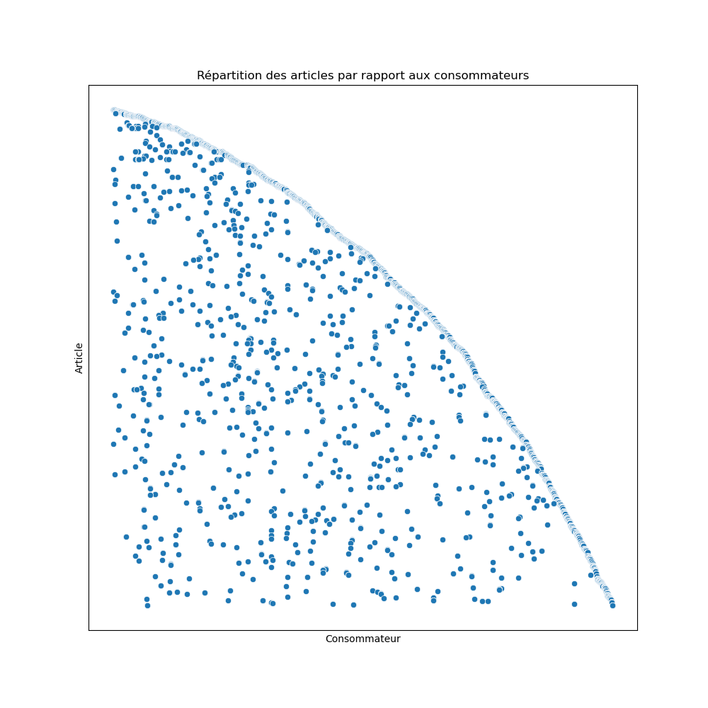

# Projet - E-Commerce Brésilien

[Projet inspiré et base de donnée tiré de Brazilian E-Commerce Public Dataset by Olist sur Kaggle.](https://www.kaggle.com/olistbr/brazilian-ecommerce)

## Objectif du projet

A travers un jeu de rôle où **Maxime CARRERE** joue le rôle du client enthousiate 
et souhaite montrer à sa hiéarchie l'utilité de la data science dans leur entreprise,
et **Pierre LEROY** qui joue le rôle d'un collègue réfractère à la data science.

Cette mise en situation a pour but de proposer un POC (proof of concept) afin de convaincre
la hiéarchie du client de soit ouvrir un service de data science soit d'avoir affaire à 
des prestataires et dans le meilleur des cas continuer avec nous pour de futurs projets.

Pour convaincre la hiéarchie, il faut exploiter les données qu'ils possèdent qui sont totalement inutilisées
et en extraire une preuve de rentabilité pour l'entreprise.

## Présentation de l'équipe

Dans cette mise en situation,  **Antoine NICOLEAU**, **Maxime LENOIR** et **Verner BOISSON** tous trois étudiants 
en Mastère 1 Expert en Intelligence Artificielle à **Ynov Bordeaux** jouent le rôle de trois
expert en intelligence artificielle venant de l'entreprise **"Oh Djadja"**.

## Contexte

L'entreprise du client est **"Olist Store"** qui se situe au Brésil. C'est une jeune entreprise néanmoins c'est le plus gros site E-Commerce 
au Brésil. Maxime CARRERE notre contact principal dans l'entreprise nous a informé sur les objectifs de l'entreprise qui sont l'international,
la création d'un "Market Place" ce qui signifie que des particulier pourrait utiliser la plateforme pour vendre des produits,
optimiser l'approvisement et les stock des entrepots, prédire les achats des utilisateurs et prévoir les plus gros flux de commandes. Ils ont comme valeur de ne pas être
intrusif et respectueux avec les consommateurs concernant la publicité et la suggestion. 

Il nous a fourni un jeu de donnée qui est la totalité de leur base de donnée concernant 100 000 commandes de 2016 à 2018 qui ont été préalablement anonymiser.

La structure de la base de donnée : 

## Introduction

En accord avec le client, nous sommes partie sur différentes idées qui nous semblait faisable et rentable pour la réalisation de ce POC.
Pour le client, c'est plus intéressant d'avoir plusieurs points différents peu développé pour convaincre sa hiéarchie
que un très développé mais qui pourrait ne pas être intéressant.

Nous sommes donc parti sur 4 idées principal :
- Visualiser les achats selon la date
- Définir des consommateur important
- Suggérer des articles aux consommateurs
- Optimiser les entrepots

## Preuves

### Vente des produits à l'année

#### Objectif

Visualiser la vente des produits par rapport à la date afin d'identifier une saisonarité pour des produits ou types de produits afin 
de mettre en valeurs les produits au bon moment ainsi que prévoir les stock au préalable.

#### Visualisation des données

Dans un premier temps, nous avons visualiser le nombre de commande par mois sur toute la durée du jeu de donnée.

On voit une progression croissante du nombre de commandes effectués sur le site pendant la première année.
Il y a eu un pic significatif en novembre. Ensuite, le nombre de commandes par mois se stabilise. 
Cependant, une fois la croissance du site stabilisé, il n'y a qu'environ 6 mois de donnée, 
ce qui ne permet pas d'extraire une saisonnalité annuel. Dans le future, avec davantages de données,
on pourrait sans doute en apprendre plus sur les produits vendu selon des périodes.

Nous avons ensuite regarder le pic de donnée de nombre en détails.

Lorsqu'on regarde le nombre de commande par jour sur le mois de novembre 2017, on s'apperçoit 
d'un pic significatif le 24 ce qui correspond au Black Friday. Repérer les jours exceptionnel ou 
les périodes exceptionnels qui pourrait se répéter chaque saison permet de préparer les stockes, 
l'achat et la charge du site.

En manipulant les données, nous avons repéré une saisonnalité qui apparaissait chaque semaine.

Cela peut avoir une utilité pour le service logistique afin d'avoir commme objectif d'avoir les arrivé de stocks en fin de semaine,
pour pas que les consommateur aillent sur d'autre site.

#### Application

Suite à cela, le client a demandé d'avoir une application qui permet de visualiser les articles les plus acheté sur une période donnée.
Nous avons donc mit en place, une application permettant d'avoir les produits les plus vendus sur une période donnée 
ainsi que des variantes qui permettent de voir l'évolution d'un produit sur une période donnée ou sur toute sa vie.

Pour utiliser l'application pour afficher les produits les plus vendu sur une période.
> Commande à ne faire qu'une fois pour toutes les applications.
> - pip install –r requirements.txt
> - Modifier le fichier ./params/configs/data_path.yaml

- Modifier le fichier ./params/configs/top_product_interval.yaml
- Faire la commande : python3 ./src/run/top_product_interval

Vous aurez donc par exemple les 3 produits les plus vendus dans la période de temps 2017-10-01 00:00:00 à 2017-12-31 00:00:00 et qui s'enregistre dans le dossier params/plot/demo/ : 

| Attention: Les graphiques n'affichent pas les dates lorsqu'il y a 0 commande et leur maximum diffèrent. |
| --- |

Pour utiliser l'application pour l'évolution d'un produit sur une période.
> Commande à ne faire qu'une fois pour toutes les applications.
> - pip install –r requirements.txt
> - Modifier le fichier ./params/configs/data_path.yaml

- Modifier le fichier ./params/configs/top_product_interval.yaml
- Faire la commande : python3 ./src/run/top_product_interval

Vous aurez donc 2 graphique, un par jour et l'autre par mois. Par exemple pour le produit '53b36df67ebb7c41585e8d54d6772e08' dans la période de '2017-01-01 00:00:00' à '2017-12-31 00:00:00' qui s'enregistre dans le dossier params/plot/demo/ : 

| Attention: Les graphiques n'affichent pas les dates lorsqu'il y a 0 commande et leur maximum diffèrent. |
| --- |

#### Conclusion

Dans un premier temps, ces graphiques et ces application peuvent aider votre service marketing à prendre des décisions.
Dans le future, avec de nouvelles données, on pourrait proposer davantages d'application.

### Définir des consommateur important

#### Objectif

Définir l'importance des consommateurs pour mettre en valeurs ceux qui contribue le plus au site ainsi que envisager 
des sanctions des consommateur les plus ingrats. Avec le client, nous avons fini par choisir deux sortes de client important.
Premièrement les clients qui dépense le plus en priorité ainsi que régulièrement ce qui peut être impoirtant pour le service 
marketing pour leur proposer des promotions afin qu'ils dépensent encore plus. Ensuite, les clients qui ont le plus d'influence, 
par rapport aux notes et leur commentaires. Afin premièrement de mettre en valeur les influenceurs qui mettent en valeur les produits,
surveiller voire punir les consommateur qui mettent des commentaires trop négatif. Aussi voire l'influence sur la popularité d'un article,
après un commentaire positif et lorsqu'un consommateur met régulièrement des commentaires positif, comprendre 
les raisons si soudainement il met un commentaire négatif sur un article.

#### Développement

Nous avons mit en place 2 scores : 
- le pouvoir économique
- le pouvoir d'influence

| customer_unique_id               |   eco_score |
|:---------------------------------|------------:|
| 0a0a92112bd4c708ca5fde585afaa872 |    268.8    |
| c8460e4251689ba205045f3ea17884a1 |    244.8    |
| c402f431464c72e27330a67f7b94d4fb |    100      |
| 698e1cf81d01a3d389d96145f7fa6df8 |     98.7    |
| 4007669dec559734d6f53e029e360987 |     89.019  |
| 763c8b1c9c68a0229c42c9fc6f662b93 |     71.6    |
| ef8d54b3797ea4db1d63f0ced6a906e9 |     71.2475 |
| eae0a83d752b1dd32697e0e7b4221656 |     68.3149 |
| 86df00dc5fd68f4dd5d5945ca19f3ed6 |     66      |
| 0f5ac8d5c31de21d2f25e24be15bbffb |     56.3558 |

| customer_unique_id               |   inf_score |
|:---------------------------------|------------:|
| 8d50f5eadf50201ccdcedfb9e2ac8455 |      40.5   |
| 1b6c7548a2a1f9037c1fd3ddfed95f33 |      17.5   |
| ca77025e7201e3b30c44b472ff346268 |      17.5   |
| 6469f99c1f9dfae7733b25662e7f1782 |      17.5   |
| 47c1a3033b8b77b3ab6e109eb4d5fdf3 |      17     |
| 9cc5a07f169a1606fd347a56683e6ea6 |      15.625 |
| 12f5d6e1cbf93dafd9dcc19095df0b3d |      15.5   |
| b4e4f24de1e8725b74e4a1f4975116ed |      15.375 |
| abfe742e782fb10f5c824fcb849e5cd1 |      15.375 |
| 74cb1ad7e6d5674325c1f99b5ea30d82 |      15     |

Voici le 10 premiers, dans le projet on fournit les 5% qui ont le plus de pouvoir 
économique et les 5% qui ont le plus ou le moins de pouvoir d'influence.

On peut voir que les 10 premiers qui ont le plus de pouvoir d'influence ne sont pas 
ceux qui ont le plus de pouvoir économioque.

#### Application

Pour utiliser l'application pour l'évolution d'un produit sur une période.
> Commande à ne faire qu'une fois pour toutes les applications.
> - pip install –r requirements.txt
> - Modifier le fichier ./params/configs/data_path.yaml

Pour avoir les 5% de consommateur qui ont le plus haut score économique 
- Faire la commande : python3 ./src/data/customer_economy_power.py

Pour avoir les 5% de consommateur qui ont le plus bas et plus haut score d'influence 
- Faire la commande : python3 ./src/data/customer_influence_power.py

#### Conclusion

Comme dit dans la partie objectif, ces personnes peuvent être très utile pour mettre plus facilement des 
commentaire en avant ou en supprimer des impertinents. Offrir des codes promo aux personnes qui dépensent le plus.
 
 Sur le long terme, il y a des voies d'améliorations comme voir l'impact que les consommateur ayant le plus 
d'influence ont comme impact sur les ventes d'articles. Repérer les personnes qui sont habitué par donné des avis positif 
qui soudainement en donnent des négatifs et comprendre pourquoi.

### Suggestion d'article
#### Objectif

Le client a quelque espace pour suggérer des produits, ceux-ci sont occupé par les articles les plus vendus.
Le problème qu'implique de suggérer les produits les plus vendus, c'est que les produits de l'actualité ne sont pas mit en avant.
Le client ne souhaite pas avoir beaucoup de spam, de newsletter, ils ont comme valeur d'être respecteux du consommateur.
Il faut donc que les produits proposés correspondent aux intérêt du consommateur.

#### Visualisation des données

Premièrement nous avons regarder les catégories avant que le client trouvait plus judicieux de voir directement les différents produits.
Nous avons découvert que la majorité des consommateurs sont des consommateurs unique (qui ont fait qu'une commande sur le site), cependant les catégorie 
nous a aiguillé sur la posibilité de faire des groupes de consommateur afin de suggérer des articles que les membres de ce groupe ont l'habitude d'acheter. 

Nous avons repéré que l'historique d'achat des consommateurs est très faible. Nous vous conseillons donc au client de ne pas utiliser l'historique pour 
le moment pour suggérer des produits.

#### Conclusion

Il faudrait étudier plus en détaille la correspondance entre les articles et les consommateurs afin de définir des groupes de consommateurs.
Cependant, pour ce POC, il nous ait difficile de suggérer des produits aux consommateurs en rapport aux achat d'autres consommateurs.
De plus, comme la majorité des consommateurs sont des consommateurs unique, utiliser leur historique d'achat est impertinent.

Actuellement, il est possible de suggérer des produits de la même catégorie que les articles du panier du consommateur, des nouveaux articles
au lieu d'utiliser uniquement les produits les plus vendus quelque soit leur catégorie. Il serait plus pertinent de proposer des articles qui 
sont pas concurrent et qui sont moins chère que ceux dans le panier.

### Optimiser les entrepots

#### Objectif

L'objectif est d'optimiser les entrepots, en proposant les entrepots les plus proches des clients afin de limiter les coûts de transport et 
réduire le temps de livraison des produits.

#### Visualisation des données

#### Application
Pour utiliser l'application pour avoir l'entrepot le plus proche.
> Commande à ne faire qu'une fois pour toutes les applications.
> - pip install –r requirements.txt
> - Modifier le fichier ./params/configs/data_path.yaml

- Modifier le fichier : ./params/configs/near_storage.yaml
- Faire la commande : python3 ./src/run/near_storage.py
#### Conclusion

Avec cette visualisation et cette application, ça peut permettre de mieux organiser les entrepots afin de réduire les temps d'attentes 
et limiter les transports de marchandise entre entrepots.

## Conclusion

### Projet

Nous estimons avoir réussit à prouver en quelques semaines que les données d'une société e-commerce qui a moins de 2 ans d'activité ont de la valeur.
Les experts des différents service concerné par notre POC peuvent prendre des décision avec davantage d'information grâce à la visualisation des données
ainsi que les application que nous avons proposé.

### Personnel

#### Verner Boisson

Ce projet a été très instructive, m'a permis de m'entraîner sur les différentes 
parties vu lors de l'élective "Machine Learning" et la majeur "Datascience".
J'estime m'être améliorer dans la partie preprocessing et visualisation des données
avec pandas et seaborn/matplotlib.
Je regrette cependant de ne pas avoir mit en place de sklearn pipeline par manque de temps pour le maîtriser.
